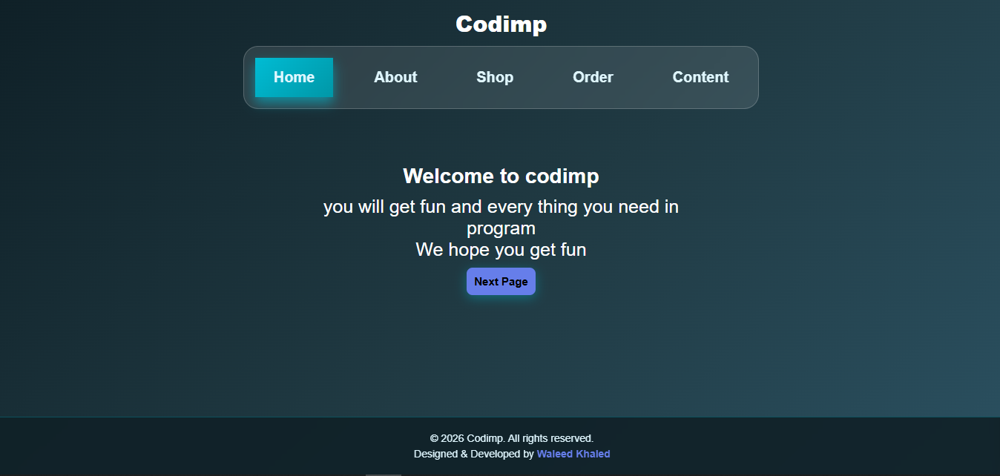

# 🎨 Layout Module - Main Application

---

## Overview

The Layout module is the core of our web application, featuring a modern and responsive design with intuitive navigation and interactive elements. This folder contains all HTML, CSS, and JavaScript files needed for the main user interface.



---

## ✨ Features

### 🎨 Beautiful UI Design
- Modern, clean interface with carefully chosen color palette
- Fully responsive layout that adapts to mobile, tablet, and desktop
- Smooth CSS animations and transitions
- Professional color scheme with accent highlights

### 🔧 Interactive Elements
- Dynamic button interactions with hover effects
- Smooth page navigation between sections
- Real-time DOM element manipulation
- Event-driven architecture

### 📱 Responsive Design
- Mobile-first approach
- Flexible grid and flexbox layouts
- Touch-friendly interface elements
- Optimized performance

---

## 📁 Folder Structure

```
Layout/
├── index.html           # Main HTML entry point
├── README.md            # This file
├── Preview.png          # Project preview image
├── css/
│   ├── main.css         # Core layout and structure styles
│   └── style.css        # Component-specific styles
└── scripts/
    ├── buttons.js       # Button interaction handlers
    ├── Elements.js      # DOM element management
    └── navigate.js      # Navigation system logic
```

---

## 🎯 Key Components

### HTML Structure
- **index.html** - Main entry point with semantic HTML5 markup
  - Well-organized sections
  - Proper semantic tags for accessibility
  - Clean, readable code structure

### CSS Styling (main.css & style.css)
- **main.css** - Foundation styles and layout framework
  - CSS variables for consistent theming
  - Grid and flexbox layouts
  - Responsive media queries
  
- **style.css** - Component-specific styles
  - Button styles and states
  - Card and container designs
  - Animation definitions
  - Theme variations

### JavaScript Modules
- **buttons.js** - Button interaction management
  - Click event handlers
  - Toggle and active states
  - Button feedback effects

- **navigate.js** - Page navigation system
  - Smooth scrolling navigation
  - Section transitions
  - URL hash management

- **Elements.js** - DOM manipulation utilities
  - Element creation and modification
  - Dynamic content updates
  - Event delegation

---

## 🚀 Getting Started

### Prerequisites
- Modern web browser (Chrome, Firefox, Safari, Edge)
- Text editor for development (VS Code, Sublime Text, etc.)
- No build tools required - works directly as static files

### Installation

1. **Open the application**
   ```bash
   # Simply open index.html in your browser
   Layout/index.html
   ```

2. **No installation needed!**
   - All CSS and JavaScript are self-contained
   - Files load directly from the file system
   - No dependencies or npm packages required

### Quick Start
1. Open `index.html` in your browser
2. Interact with the buttons and navigation elements
3. View the browser console (F12) to see debugging information

---

## 🎨 Design System

### Color Palette
| Color | Usage | Hex Code |
|-------|-------|----------|
| Primary Blue | Headers, CTAs | `#0066CC` |
| Secondary Light | Backgrounds | `#F5F7FA` |
| Accent Orange | Highlights, Hover | `#FF6B35` |
| Dark Gray | Text Content | `#2C3E50` |
| Success Green | Confirmations | `#27AE60` |
| Error Red | Warnings | `#E74C3C` |

### Typography

**Font Family:** `'Segoe UI', Tahoma, Geneva, Verdana, sans-serif`

| Element | Size | Weight | Usage |
|---------|------|--------|-------|
| H1 | 2.5rem | 700 | Page Title |
| H2 | 1.75rem | 600 | Section Heading |
| H3 | 1.25rem | 600 | Subsection |
| Body | 1rem | 400 | Regular Text |
| Small | 0.875rem | 400 | Captions |

### Spacing Scale
- Base Unit: `8px`
- `xs`: 4px | `sm`: 8px | `md`: 16px | `lg`: 24px | `xl`: 32px

---

## 💻 Technology Stack

- **HTML5** - Semantic markup structure
- **CSS3** - Modern styling with Grid, Flexbox, and animations
- **Vanilla JavaScript** - No framework dependencies
- **CSS Variables** - Dynamic theming and maintainability

### CSS Features
- Responsive Grid Layout
- Flexbox for components
- CSS Transitions & Animations
- Media Queries for mobile responsiveness
- CSS Custom Properties (Variables)

---

## 📸 Preview


---

## 🔧 File Descriptions

### Main Files

| File | Size | Description |
|------|------|-------------|
| `index.html` | - | Main application entry point with semantic HTML5 |
| `css/main.css` | - | Primary stylesheet with layout structure and responsiveness |
| `css/style.css` | - | Component-specific styles, animations, and themes |
| `scripts/buttons.js` | - | Button event handlers and interaction logic |
| `scripts/navigate.js` | - | Navigation system and page transitions |
| `scripts/Elements.js` | - | DOM element manipulation and utilities |

---

## 🎓 Usage Examples

### Navigation Function
```javascript
// Navigate to a specific section smoothly
navigate.goTo('section-id');

// With callback
navigate.goTo('section-id', () => {
  console.log('Navigation complete');
});
```

### Button Interactions
```javascript
// Add click handler to button
const button = document.querySelector('#myButton');
button.addEventListener('click', () => {
  console.log('Button clicked!');
});

// Using buttons module
buttons.setupClickHandlers();
```

### DOM Manipulation
```javascript
// Using Elements module
const newElement = Elements.create('div', 'container');
Elements.append(newElement, 'parent-id');

// Update element content
Elements.setText('element-id', 'New content');
```

---

## 🌟 Best Practices Implemented

✅ **Semantic HTML** - Proper use of semantic elements for accessibility
✅ **Mobile-First Design** - Responsive across all devices and screen sizes
✅ **CSS Architecture** - Well-organized stylesheet structure
✅ **Module Pattern** - JavaScript organized into functional modules
✅ **Performance** - Optimized CSS and minimal JavaScript
✅ **Maintainability** - Clean, readable, and documented code
✅ **User Experience** - Smooth interactions, feedback, and animations

---

## 🐛 Known Issues & Roadmap

### Current Limitations
- No backend/server-side features
- No data persistence beyond page reload
- Limited browser compatibility for older versions

### Future Enhancements
- [ ] Dark mode theme toggle
- [ ] Multi-language support (i18n)
- [ ] Animation performance improvements
- [ ] Progressive Web App (PWA) features
- [ ] Service Worker integration
- [ ] Enhanced accessibility features

---

## 📄 License

This project is open source and available under the MIT License.

---

## 🤝 Contributing

Contributions are welcome! Here's how you can help:
1. **Report bugs** - Describe the issue with steps to reproduce
2. **Suggest improvements** - Share your ideas for enhancements
3. **Code improvements** - Optimize or refactor existing code
4. **Documentation** - Improve README and code comments

---

## 📞 Support & Contact

For questions, suggestions, or issues:
- 📧 Email: support@projectname.com
- 💬 Open an issue in the project repository
- 📝 Check existing documentation above

---

## Version History

| Version | Date | Changes |
|---------|------|---------|
| 1.0.0 | 2026-04-03 | Initial release |

---

---

## 🎯 Next Steps

1. **Open the application**: Double-click `index.html` to view in your browser
2. **Explore the code**: Review the HTML, CSS, and JavaScript files
3. **Customize**: Modify styles and functionality to suit your needs
4. **Deploy**: Use the files as-is for static hosting

---

**Layout Module** | *Last Updated: April 3, 2026* | **Happy Coding!** ✨
